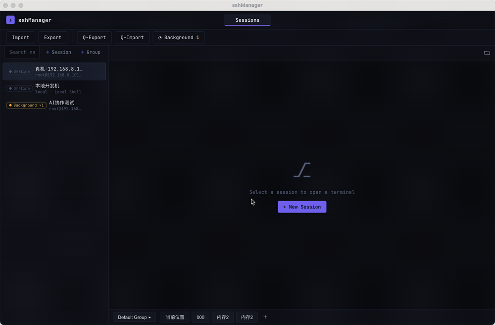

<div align="center">

# sshManager

**AI-assisted SSH client — human & AI collaborate in one shared terminal**

[English](README.md) · [简体中文](README.zh-CN.md)

</div>

A **human-machine collaborative SSH session manager**: human and AI work on the **same terminal session** from a browser or a desktop app. The AI can silently operate a connection in the background (run commands, search files, manage SFTP), or inject commands into a shared terminal that the human sees live.

## Features

- **Session & group management** — filter by name/IP simultaneously, import/export (JSON file or clipboard), background keep-alive with one-click restore
- **Multi-tab terminal** — each tab is an independent SSH connection; closing a tab keeps SSH running in the background
- **Quick commands** — groups + commands CRUD, send to terminal (echo-only, or auto-run with a trailing newline), import/export
- **SFTP panel** — browse / upload (drag & drop) / download / edit / delete / recursive search
- **AI capability discovery** — `GET /api/ai/capabilities` lets an AI agent self-discover and call every backend capability
- **AI dual-path execution** — independent (non-interactive `exec`/`find`, no concurrency) or collaborative (inject into a shared terminal the human sees)
- **Incremental output buffer** — AI reads only *new* output via a `?since=` offset (saves context)

## Quick Start

### Desktop (Electron)

```bash
cd frontend && npm start
```

### Browser

```bash
cd backend && .venv/bin/python run.py
# → http://127.0.0.1:8747
```

### Install dependencies

```bash
python3 -m venv backend/.venv && backend/.venv/bin/pip install -r backend/requirements.txt
cd frontend && npm install
```

## Restore a Background Session (demo)

Closing a tab only detaches the page — the SSH connection keeps running in the background (output keeps accumulating). Reopen the app and bring the session back with one click:



*Full-resolution video: [recover.mp4](recover.mp4)*

- Open **◔ Background** in the top bar — every background connection across all sessions is listed here, with its session name + host. Click a row to restore it into a tab.
- **Sessions created by the AI work the same way**: when the AI opens a connection on a session it created (or any session), that connection shows up in the background list and can be restored just like a human-created one.

## Tech Stack

| Layer      | Tech                                   |
|------------|----------------------------------------|
| Terminal   | xterm.js · @xterm/addon-fit            |
| Desktop    | Electron                               |
| Backend    | Python FastAPI · asyncssh              |
| Storage    | JSON files (sessions / groups / quick) |
| AI         | Capability discovery API (`/api/ai/capabilities*`) |

## Architecture (summary)

- **Python backend owns the pty** — the frontend and the AI are both clients of it.
- **Connection model** — a session config can spawn multiple independent SSH connections (`conn_id`); each has its own pty + output buffer.
- **AI interference goes through backend APIs, not frontend JS** — so the Electron shell can later be dropped for a pure-browser form.
- **Background keep-alive** — closing a tab detaches, SSH stays alive and is restorable.

See [docs/architecture.md](docs/architecture.md) for the full picture.

## Documentation

- [Usage Guide — Human & AI](docs/usage.md)
- [Architecture](docs/architecture.md)
- [Features](docs/features.md)
- [Implementation](docs/implementation.md)

## Branches

- **`main`** — development trunk. All core features (sessions / terminal / AI / SFTP / Electron) live here; `npm start` and `python run.py` work as-is.
- **`feat/packaging`** — distributable packaging (PyInstaller backend freeze + electron-builder). Check out this branch to build a macOS `.app` / `.dmg`:

  ```bash
  git checkout feat/packaging
  cd backend && .venv/bin/pip install "pyinstaller>=6.21"
  cd ../frontend && npm install
  npm run package:backend && CSC_IDENTITY_AUTO_DISCOVERY=false npx electron-builder --mac
  ```

  Build output (`frontend/dist/*.dmg`, `*.app`) is gitignored — the distributable is never committed to the repo.

  Packaging is not merged to `main` yet; merge it once proven: `git checkout main && git merge feat/packaging`.

## Roadmap

- [ ] AI background WebSocket echo → "work together" mode
- [ ] Drag-and-drop sorting for sessions / groups / commands
- [ ] Encrypted credential storage

## Tested Against

- pytest 12/12 passing · browser E2E · Electron smoke test
- Real SSH host (CentOS 7) — connect / exec / find / SFTP / interactive terminal all verified

## License

Private project. Contact the owner for licensing questions.
